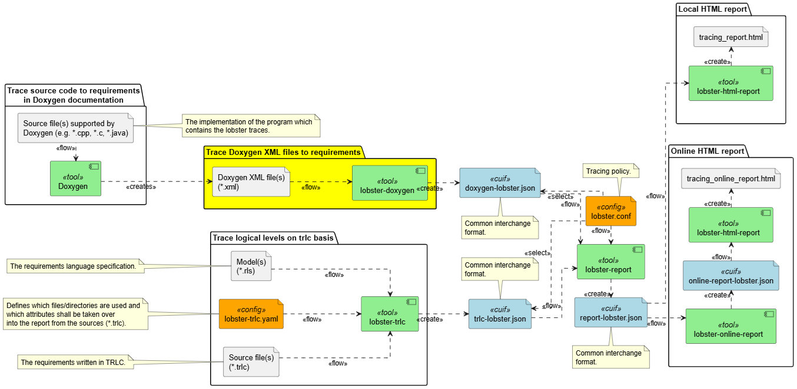

# lobster-doxygen <!-- omit in toc -->

[](https://choosealicense.com/licenses/gpl-3.0/) [](https://www.repostatus.org/#wip) [](https://github.com/NewTec-GmbH/lobster-doxygen/actions/workflows/test.yml)

- [Overview](#overview)
- [Installation](#installation)
- [Usage](#usage)
  - [Tool](#tool)
  - [Sourcecode](#sourcecode)
- [Doxygen Configuration](#doxygen-configuration)
- [Examples](#examples)
- [SW Documentation](#sw-documentation)
- [Used Libraries](#used-libraries)
- [Issues, Ideas And Bugs](#issues-ideas-and-bugs)
- [License](#license)
- [Contribution](#contribution)

## Overview

lobster-doxygen is a python commandline tool to extract requirement annotations from doxygen comments using
doxygen's XML output format. It produces the
[LOBSTER common interchange format](https://github.com/bmw-software-engineering/lobster/blob/main/documentation/schemas.md)
as output. A major advantage of lobster-doxygen is that the XML input files can come from every doxygen supported programming
language, including C, C++, Python, Java, Objective-C, PHP, Fortran, and more. This allows a straightforward and standardized
integration into the LOBSTER TRLC toolchain. Note, at the moment C and C++ are in focus!

Using [doxygen aliases](https://www.doxygen.nl/manual/config.html#cfg_aliases) inside source code comments makes tracing from
code quite simple. The following aliases are supported:

- ```@implements{<REQ-ID>}```  to link to requirments for tracing.

- ```@justification{<JUSTIFY-PLEASE>}```  to justify why no tracing is required, but the code fragment is needed.

> [!NOTE]  
> lobster-doxygen is not a standalone solution, but a component extending the
> [BMW LOBSTER tooling](https://github.com/bmw-software-engineering/lobster). Understanding of the LOBSTER tool purpose and usage
> is required to benefit from lobster-doxygen.

The following diagram shows how lobster-doxygen fits into the LOBSTER toolchain. It provides a data flow path from source code
to the LOBSTER common interchange format.



## Installation

- `git clone https://github.com/NewTec-GmbH/lobster-doxygen.git` to clone repository.
- `cd lobster-doxygen` to go to root directory.
- It is recommended to use a virtual environment:
  - In VS-Code: `Ctrl+Shift+P` type **Python: Create Environment**: select `Venv`.
    - When asked, select the Python version you want to work with, based on the versions installed in your machine.
    - When asked, select `dev` to be installed. This will set-up the development environment, including all the tools used in this template.
    - In the background, VS Code will install all the dependencies. This may take some time.
    - To activate the virtual environment, close all terminal panels inside of VS-Code.
      You can double check if the virtual environment is active, e.g. by `pip -V` the displayed path should point to your virtual environment.
  - In PowerShell:
    - `python -m venv .venv` to create the virtual environment.
    - `.venv\Scripts\Activate.ps1` to activate it.
    - `pip install -e .` to install required packages.
    - `pip install -e .[dev]` to install additional packages for development.
  - Under Linux / MacOS:
    - `python -m venv .venv` to create the virtual environment.
    - `source .venv/bin/activate` to activate it.
    - `pip install -e .` to install required packages.
    - `pip install -e .[dev]` to install additional packages for development.
  For more details about handling Venv, see [Python venv: How To Create, Activate, Deactivate, And Delete](https://python.land/virtual-environments/virtualenv#Python_venv_activation)

## Usage

### Tool

lobster-doxygen is a command line application that is configured via command line arguments.

```md
usage: lobster-doxygen [-h] [--version] [-o OUTPUT] [-v] doxygen_xml_folder

Convert doxygen XML output to lobster common interchange format.

- The source code header requires a doxygen header with at least the @file tag.
  - Rational: The doxygen XML output will consider the aliases on file level only if the file has the @file tag.
- Tracing supports the following levels:
  - Class/Struct/Union/Namespace
  - Method
  - Function
- Tracing on file level is possible, but not recommended and therefore the tool will abort with an error.

To specify a requirement use @implements{REQ}.
To specify a justification use @justification{JUSTIFICATION}.

positional arguments:
  doxygen_xml_folder        Path to the doxygen XML output folder.

options:
  -h, --help            show this help message and exit
  --version             show program's version number and exit
  -o OUTPUT, --output OUTPUT
                        Output file name. Default: lobster.json
  -v, --verbose         Enable verbose output.
```

### Sourcecode

The following example shows how requirement annotations in source code will look like, using doxygen annotation.

```cpp

/**
 * @brief This is my class.
 *
 * @implements{SwRequirement.myClass}
 */
class MyClass;

/**
 * @brief This is my function.
 *
 * @implements{SwRequirement.myFunc}
 */
extern myFunc();

/**
 * @brief This is my class to show a justification.
 *
 * @justification{This is my justification ...}
 */
class JustifyMeClass;

```

Please be aware of how to document in general using doxygen, see the [attention hint in the doxygen documentation](https://www.doxygen.nl/manual/docblocks.html#structuralcommands). Otherwise traces may be missed or undocumented code will be hidden.

## Doxygen Configuration

In order to feed lobster-doxygen with the correct data, Doxygen needs to be configured.
The following ALIASES definitions inside the `Doxyfile` are needs to support the requirement annotations:

```bash
ALIASES                = "implements{1}=@xrefitem implements \"Implements\" \"Requirement Traceability\" Requirement: \1" \
                         "justification{1}=@xrefitem justified \"Justified\" \"Justification Overview\" Justification: \1"
```

Change the extract settings as follows to instruct Doxygen to use all entities in documentation:

```bash
EXTRACT_ALL            = YES
```

```bash
EXTRACT_PRIVATE        = YES
```

```bash
EXTRACT_PRIV_VIRTUAL   = YES
```

```bash
EXTRACT_PACKAGE        = YES
```

```bash
EXTRACT_STATIC         = YES
```

```bash
EXTRACT_LOCAL_CLASSES  = YES
```

```bash
EXTRACT_LOCAL_METHODS  = YES
```

```bash
EXTRACT_ANON_NSPACES   = YES
```

Finally enable the XML output generation:

```bash
GENERATE_XML           = YES
```

Once doxygen has run successfully, the `xml` directory can be used as the `doxygen_xml_folder` when calling lobster-doxygen.
An example `Doxyfile` can be found in the [examples](./examples) directory.

## Examples

Check out the [Examples](./examples) subpage for using the included example(s).

## SW Documentation

More information on the deployment and architecture can be found in the [documentation](./doc/README.md) subpage.

For Detailed Software Design run `$ /doc/detailed-design/make html` to generate the detailed design documentation that then can be found
in the folder `/doc/detailed-design/_build/html/index.html`

## Used Libraries

Used 3rd party libraries which are not part of the standard Python package:

| Library | Description | License |
| ------- | ----------- | ------- |
| [toml](https://github.com/uiri/toml) | Parsing [TOML](https://en.wikipedia.org/wiki/TOML) | MIT |
| [trlc](https://github.com/bmw-software-engineering/trlc) | Treat Requirements Like Code | GPL-3.0 |
| [doxmlparser](https://github.com/doxygen/doxygen) | Parsing Doxygen XML | GPLv2 |
| [rich](https://rich.readthedocs.io/en/stable/index.html) | Console output | MIT |

---

## Issues, Ideas And Bugs

If you have further ideas or you found some bugs, great! Create an [issue](https://github.com/NewTec-GmbH/lobster-doxygen/issues) or if you are able and willing to fix it by yourself, clone the repository and create a pull request.

## License

The whole source code is published under [GNU General Public License Version 3](https://github.com/NewTec-GmbH/lobster-doxygen/blob/main/LICENSE).
Consider the different licenses of the used third party libraries too!

## Contribution

Unless you explicitly state otherwise, any contribution intentionally submitted for inclusion in the work by you, shall be licensed as above, without any additional terms or conditions.
