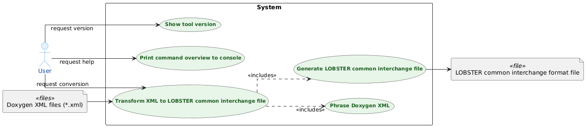
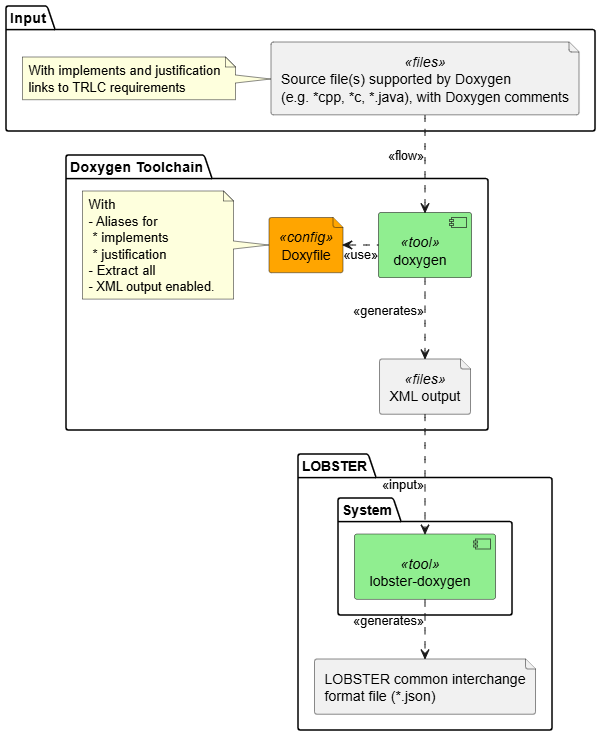

# Software Architecture

The following section describes the high level software architecture.
For an overview of the complete LOBSTER toolchain see the Overview section in [main README](../README.md).

The lobster-doxygen tool is a converter from the Doxygen XML format into the LOBSTER interchange file Format. It enables the generation of LOBSTER traces from from source code based on annotations in doxygen comments.

## Use Cases

## Context Diagram

The following picture shows the overall tool flow:

## Static View

The following diagram shows the static architecture of the tool. It contains the components (Python modules) and their relations:

## Dynamic View

The following diagram shows the dynamic view of the tool using a sequence diagram:

