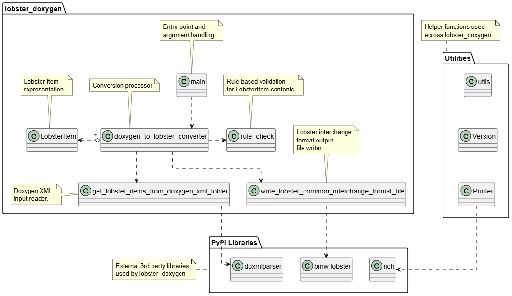

# Software Architecture

The following section describes the high level software architecture. 
For a overview of the complete TRLC LOBSTER toolchain see Overview section in [main README](../README.md).

## Use Cases

## Context Diagram

## Class Diagram

